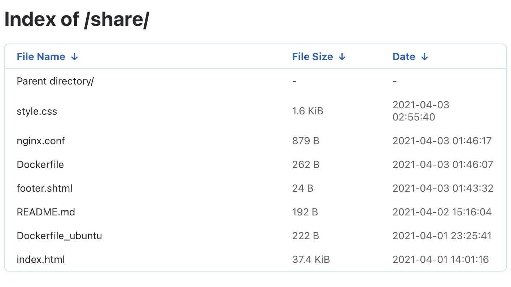
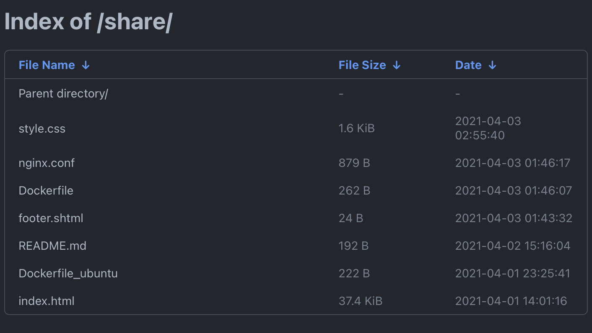

# Docker File Server

Nginx file server base on docker

- GitHub Light theme
- GitHub Dark dimmed theme

```zsh
docker pull cntrump/file-server
docker run --rm -p 80:80 -p 443:443 -v ${PWD}:/data cntrump/file-server
```

visit: http://localhost/share




